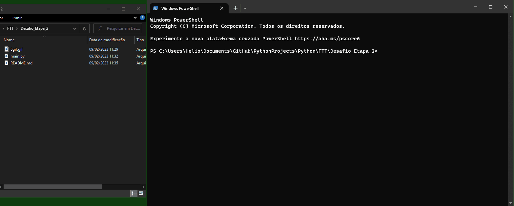

# Gerenciador de personagens

Este script permite a criação e visualização de personagens.

Esses personagens são salvos no arquivo de texto file.txt

Em funcionamento:

Info:
- Utiliza Python 3.9.6
- Só utiliza a biblioteca padrão do Python.
- Só foi testado no Windows 10.