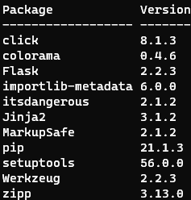

# Gerenciador de personagens e pequena API

Instruções para executar o projeto:
- Instalar Flask com `pip install flask`
- Abrir um terminal na pasta "DESAFIO_ETAPA_3", e executar com `python .\main.py` ou `python .\api.py`
- Mandar requests para http://127.0.0.1:5000/characters. Com o Postman, ou modulo requests do Python, ou outros meios para mandar requests e receber responses.
- GET pega a lista de todos os personagens.
- POST cria um personagem. POST precisa incluir o personagem em JSON. Um exemplo de personagem em JSON:
```json
{
    "nome": "Hulk",
    "descrição": "personagem com superforça",
    "link": "aaaaaaaaaaa.png",
    "programa": "paint.net",
    "animador": "Maria"
}
```

<!-- Em funcionamento: -->
<!--  -->


Informações principais:
- Utiliza Python 3.9.6
- Só foi testado no Windows 10.
- Bibliotecas utilizadas:
    - sys (padrão)
    - json (padrão)
    - textwrap (padrão)
    - flask
- O gerenciador de personagens agora utiliza um banco de dados em JSON
- O framework utilizado foi o Flask
- A API consegue ler o banco de dados, e armazenar um novo personagem nele.
- A API está rodando em http://127.0.0.1:5000/characters
- Usei a ferramenta Postman para mandar requests

Informações extras:
- Executando main.py executa o gerenciador
- Executando api.py executa a API
- Os dois podem ser executados ao mesmo tempo, mas para isso são necessários 2 janelas de terminais.


Comando `pip list` no virtual environment utilizado:

